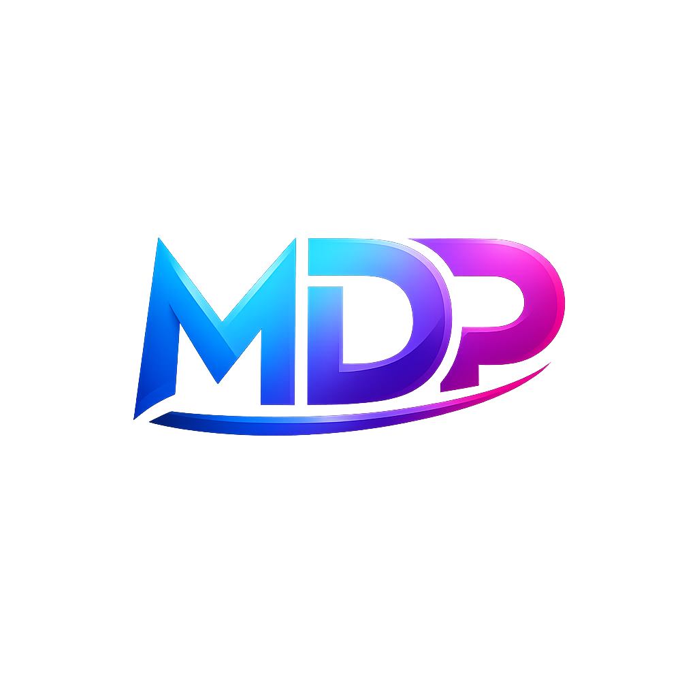

<div align="center">
  
</div>

<h1 align="center">Mokara Durga Prasad — Professional Portfolio</h1>

<div align="center">
  
  
  
  
  
  
</div>

<br />

A modern, highly interactive portfolio website designed to showcase my skills, projects, certifications, and educational background. This project was built from the ground up prioritizing beautiful aesthetics, performance, and seamless animations.

It features a fully functional administration panel to update portfolio details dynamically via a backend database, empowering the website to stay up-to-date without touching code!

## ✨ Features

- **Full-Stack Dynamic Content** — Every section (skills, projects, certifications, education, about) is powered by a cloud backend database.
- **Secure Admin Dashboard** — Protected admin control panel route (`/admin/login`) with CRUD capabilities to manage all portfolio data easily.
- **Fully Responsive Matrix** — Optimized for flawless performance and layouts across mobile, tablet, and desktop viewports.
- **Dark/Light Theme Toggle** — Native theme toggling capability with fluid CSS transitions using `next-themes`.
- **Fluid & Smooth Animations** — Extensive use of Framer Motion for scroll-reveals, hover-effects, and component transitions.
- **Rich Contact System** — Built-in contact form directly connecting visitors.

## 🛠️ Technology Stack

This project was built leveraging cutting-edge web technologies to ensure optimal performance and developer experience.

### Frontend
- **Framework**: React 18, TypeScript, Vite
- **Styling**: Tailwind CSS
- **UI Architecture**: shadcn/ui & Radix UI primitives
- **Animation Framework**: Framer Motion
- **State Management & Data Fetching**: TanStack React Query

### Backend & Cloud Services
- **Backend & Database**: Lovable Cloud (Edge functions, PostgreSQL)
- **Authentication**: Supabase Auth

## 🚀 Getting Started

To run this project locally, simply follow these steps:

### Prerequisites
Make sure you have Node.js and a package manager installed. The project relies on Node (v18+) and npm/bun.

### Installation & Setup

1. **Clone the repository:**
   ```bash
   git clone https://github.com/durgaprasad-mokara/Durga-Prasad-Portfolio.git
   cd Durga-Prasad-Portfolio
   ```

2. **Install dependencies:**
   ```bash
   # If you use npm:
   npm install --legacy-peer-deps
   
   # Or using bun (recommended):
   bun install
   ```

3. **Start the development server:**
   ```bash
   npm run dev
   # or
   bun run dev
   ```

4. **Open your browser** to `http://localhost:8080/` (or whichever port Vite successfully binds to) to see the application running.

## 📁 Project Structure

Below is an overview of the core source directory structure:

```
src/
├── assets/           # Static images, logos, etc.
├── components/       # Reusable React components
│   ├── ui/           # Complex generic elements & shadcn components
│   ├── HeroSection   # Interactive 3D graphics and landing content
│   ├── AboutSection  # Biography and highlights
│   ├── SkillsSection # Skill-trees and matrices
│   ├── ProjectsSection
│   ├── CertificationsSection
│   ├── EducationSection
│   └── ContactSection
├── pages/
│   ├── Index.tsx     # The primary landing/Home user-facing page
│   ├── AdminLogin    # Authentication portal for the dashboard
│   └── admin/        # Authenticated Admin CRUD interfaces
├── hooks/            # Custom reusable React hooks (e.g. useAuth, useTheme)
└── integrations/     # Supabase backend client configuration & types
```

## 📬 Contact & Links

- **LinkedIn**: [Durga Prasad Mokara](https://www.linkedin.com/in/durga-prasad-mokara/)
- **GitHub**: [@durgaprasad-mokara](https://github.com/durgaprasad-mokara)

---

<p align="center">
  Released under the MIT License • © 2026 Mokara Durga Prasad. All rights reserved.
</p>
